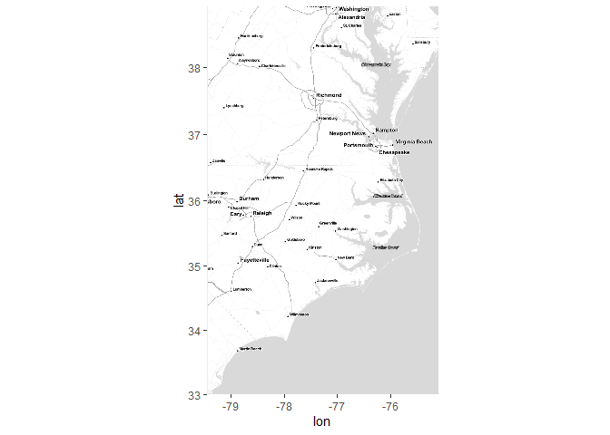
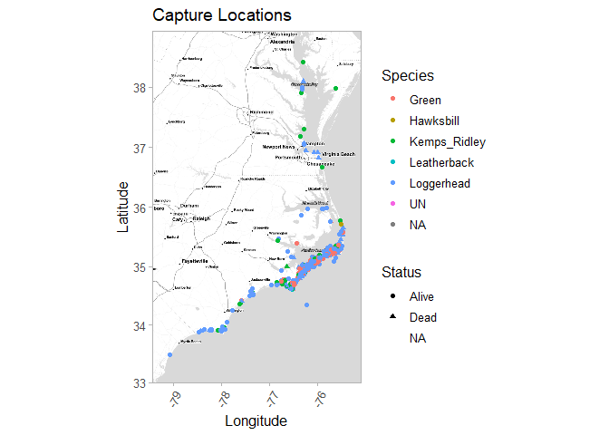
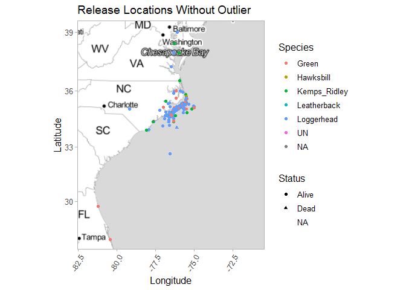
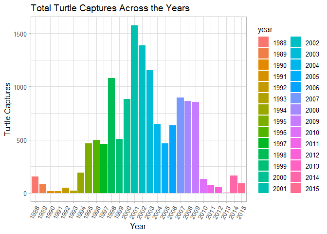
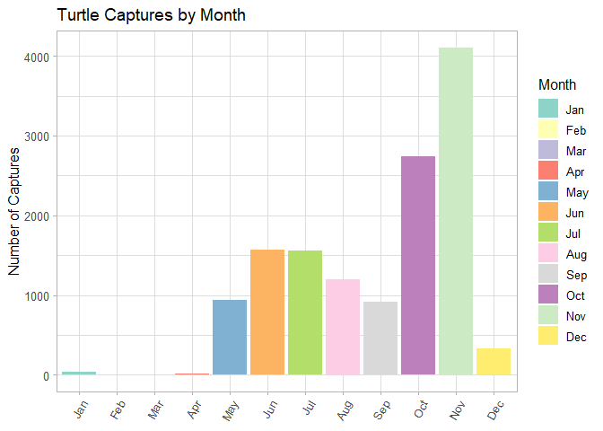
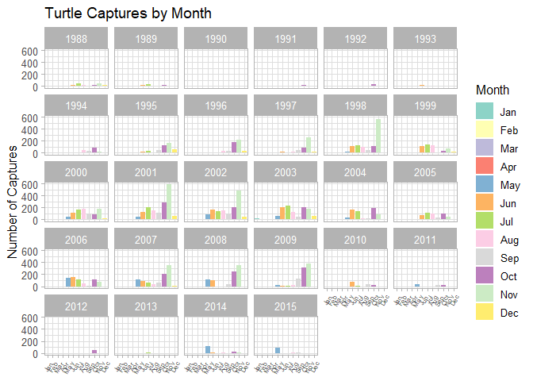
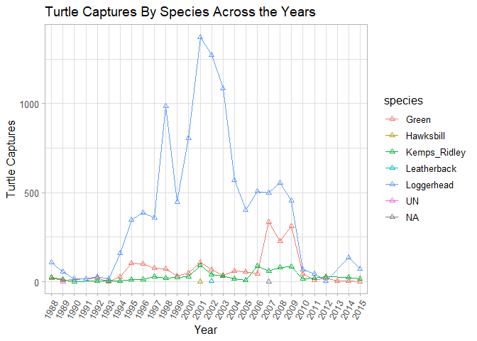
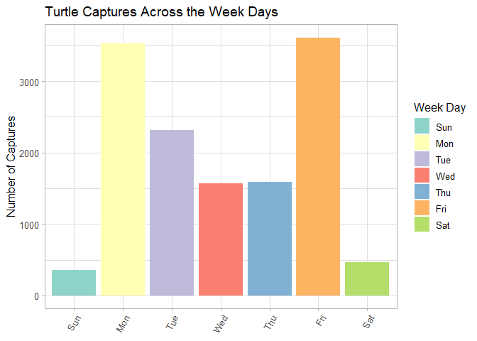

```r
library(here)
```

```
## here() starts at C:/Users/ericc/Desktop/BIS15L-Group3-Final
```

```r
library(tidyverse)
```

```
## -- Attaching packages --------------------------------------- tidyverse 1.3.0 --
```

```
## v ggplot2 3.3.3     v purrr   0.3.4
## v tibble  3.0.6     v dplyr   1.0.3
## v tidyr   1.1.2     v stringr 1.4.0
## v readr   1.4.0     v forcats 0.5.1
```

```
## -- Conflicts ------------------------------------------ tidyverse_conflicts() --
## x dplyr::filter() masks stats::filter()
## x dplyr::lag()    masks stats::lag()
```

```r
library(naniar)
library(janitor)
```

```
## 
## Attaching package: 'janitor'
```

```
## The following objects are masked from 'package:stats':
## 
##     chisq.test, fisher.test
```

```r
library(shiny)
library(paletteer)
library(ggmap)
```

```
## Google's Terms of Service: https://cloud.google.com/maps-platform/terms/.
```

```
## Please cite ggmap if you use it! See citation("ggmap") for details.
```

```r
library(rgeos)
```

```
## Loading required package: sp
```

```
## rgeos version: 0.5-5, (SVN revision 640)
##  GEOS runtime version: 3.8.0-CAPI-1.13.1 
##  Linking to sp version: 1.4-5 
##  Polygon checking: TRUE
```

```r
library(rgdal)
```

```
## rgdal: version: 1.5-23, (SVN revision 1121)
## Geospatial Data Abstraction Library extensions to R successfully loaded
## Loaded GDAL runtime: GDAL 3.2.1, released 2020/12/29
## Path to GDAL shared files: C:/Users/ericc/Documents/R/win-library/4.0/rgdal/gdal
## GDAL binary built with GEOS: TRUE 
## Loaded PROJ runtime: Rel. 7.2.1, January 1st, 2021, [PJ_VERSION: 721]
## Path to PROJ shared files: C:/Users/ericc/Documents/R/win-library/4.0/rgdal/proj
## PROJ CDN enabled: FALSE
## Linking to sp version:1.4-5
## To mute warnings of possible GDAL/OSR exportToProj4() degradation,
## use options("rgdal_show_exportToProj4_warnings"="none") before loading rgdal.
## Overwritten PROJ_LIB was C:/Users/ericc/Documents/R/win-library/4.0/rgdal/proj
```

```r
library(devtools)
```

```
## Loading required package: usethis
```

```r
library(lubridate)
```

```
## 
## Attaching package: 'lubridate'
```

```
## The following objects are masked from 'package:rgeos':
## 
##     intersect, setdiff, union
```

```
## The following objects are masked from 'package:base':
## 
##     date, intersect, setdiff, union
```

```r
library(leaflet)
```

```
## Warning: package 'leaflet' was built under R version 4.0.4
```

```r
library(leaflet.extras)
```

```
## Warning: package 'leaflet.extras' was built under R version 4.0.4
```

```r
library(leaflet.minicharts)
```

```
## Warning: package 'leaflet.minicharts' was built under R version 4.0.4
```


```r
turtles<-read.csv(here("Final Project","Official Final Project Documents/Turtle_data.csv"))
```


```r
turtles_tidy<-turtles%>%
  na_if("")%>%
  na_if("0")%>%
  na_if("0.0")%>%
  mutate(dead_alive_new=if_else(Dead_Alive=="alive","Alive",Dead_Alive))
```


```r
turtles3<-turtles_tidy%>%
  mutate(DateCapture_new=dmy(DateCapture))%>%
  filter(!is.na(DateCapture_new))%>%
  mutate(Capture_month=month(DateCapture_new))%>%
  mutate(Capture_day=day(DateCapture_new))%>%
  mutate(capture_week_day=wday(DateCapture_new))
turtles3<-clean_names(turtles3)
```


```r
turtles3%>%
  select(cap_latitude,cap_longitude)%>%
  summary()
```

```
##   cap_latitude   cap_longitude   
##  Min.   :33.49   Min.   :-79.08  
##  1st Qu.:34.84   1st Qu.:-76.38  
##  Median :34.93   Median :-76.27  
##  Mean   :34.96   Mean   :-76.24  
##  3rd Qu.:35.05   3rd Qu.:-76.13  
##  Max.   :38.41   Max.   :-75.47
```


```r
cap_lat <- c(33.49, 38.41)
cap_long <- c(-79.08, -75.47)
bbox <- make_bbox(cap_long, cap_lat, f = 0.1)
```


```r
cap_map_base <- get_map(bbox, maptype = "toner-lite", source = "stamen")
```

```
## Map tiles by Stamen Design, under CC BY 3.0. Data by OpenStreetMap, under ODbL.
```

```r
ggmap(cap_map_base)
```

<!-- -->


```r
ggmap(cap_map_base) + 
  geom_point(data = turtles3, aes(cap_longitude,cap_latitude,color=species,shape=dead_alive_new), size = 1.5) +
  scale_fill_brewer(palette = "Set1")+
  theme_light(base_size = 12)+
     theme(axis.text.x = element_text(angle = 60, hjust = 1))+
           labs(x = "Longitude", y = "Latitude", title = "Capture Locations")
```

```
## Warning: Removed 1 rows containing missing values (geom_point).
```

<!-- -->


```r
turtles3%>%
  select(rel_latitude,rel_longitude)%>%
  summary()
```

```
##   rel_latitude   rel_longitude   
##  Min.   :27.82   Min.   :-81.24  
##  1st Qu.:34.83   1st Qu.:-76.38  
##  Median :34.89   Median :-76.33  
##  Mean   :34.92   Mean   :-76.26  
##  3rd Qu.:35.04   3rd Qu.:-76.12  
##  Max.   :39.00   Max.   :-36.03  
##  NA's   :351     NA's   :353
```


```r
rel_lat <- c(27.82, 39)
rel_long <- c(-81.24, -36.03)
bbox2 <- make_bbox(rel_long, rel_lat, f = 0.05)
```


```r
rel_map_base <- get_map(bbox2, maptype = "toner-lite", source = "stamen")
```

```
## Map tiles by Stamen Design, under CC BY 3.0. Data by OpenStreetMap, under ODbL.
```

```r
ggmap(rel_map_base)
```

<!-- -->


```r
ggmap(rel_map_base) + 
  geom_point(data = turtles3, aes(rel_longitude,rel_latitude,color=species,shape=dead_alive_new), size = 1.5) +
  scale_fill_brewer(palette = "Set1")+
  theme_light(base_size = 12)+
     theme(axis.text.x = element_text(angle = 60, hjust = 1))+
           labs(x = "Longitude", y = "Latitude", title = "Release Locations")
```

```
## Warning: Removed 353 rows containing missing values (geom_point).
```

<!-- -->

```r
ggmap(rel_map_base) + 
  geom_point(data = turtles3, aes(rel_longitude,rel_latitude,color=species,shape=dead_alive_new), size = 1.5) +
  xlim(-82,-71)+
  scale_fill_brewer(palette = "Set1")+
  theme_light(base_size = 12)+
     theme(axis.text.x = element_text(angle = 60, hjust = 1))+
           labs(x = "Longitude", y = "Latitude", title = "Release Locations Without Outlier")
```

```
## Scale for 'x' is already present. Adding another scale for 'x', which will
## replace the existing scale.
```

```
## Warning: Removed 1 rows containing missing values (geom_rect).
```

```
## Warning: Removed 357 rows containing missing values (geom_point).
```

<!-- -->


```r
library(shinydashboard)
```

```
## 
## Attaching package: 'shinydashboard'
```

```
## The following object is masked from 'package:graphics':
## 
##     box
```

#Qualitative Data of Turtle Captures over Time


```r
turtles3$year<-as.character(turtles3$year)
ui <- dashboardPage(skin="green",
  dashboardHeader(title = "Turtle Captures"),
  dashboardSidebar(disable = F),
  dashboardBody(selectInput("species", "Select Species:", 
                  choices=unique(turtles3$species)),
  fluidRow(
  box(title = "Plot Options", width = 4,
  selectInput("x", "Catch Details", choices = c("research_type","dead_alive_new", "body_area_pit","body_area","record_type","cap_region","rel_region"), 
              selected = "record_type"),
      hr(),
      helpText("Source: (https://www.fisheries.noaa.gov/inport/item/35875). Capture efforts were conducted to evaluate the growth rates, sex ratios, size distribution, species composition, genetic composition, relative survival rates and foraging ecology of sea turtle populations in NC.")
  ), 
  box(title = "Turtle Information", width = 8,
  plotOutput("plot", width = "800px", height = "500px")
  ) 
  ) 
  ) 
  )
server <- function(input, output, session) { 
  
  output$plot <- renderPlot({
  turtles3 %>%
      filter(species == input$species) %>%
  ggplot(aes_string(x ="year",fill = input$x)) +
  geom_bar(position = "dodge")+
       scale_fill_brewer(palette = "Set1")+
  theme_light(base_size = 18)+
     theme(axis.text.x = element_text(angle = 60, hjust = 1))+
      labs(title = "Turtle Catch Characterisitics",x=NULL,y="Number of Turtles")
  })
  
  session$onSessionEnded(stopApp)
  }

shinyApp(ui, server)
```

`<div style="width: 100% ; height: 400px ; text-align: center; box-sizing: border-box; -moz-box-sizing: border-box; -webkit-box-sizing: border-box;" class="muted well">Shiny applications not supported in static R Markdown documents</div>`{=html}


#What Tests were performed on Turtles over time


```r
turtles3$year<-as.character(turtles3$year)
ui <- dashboardPage(skin="green",
  dashboardHeader(title = "Turtle Capture Tests"),
  dashboardSidebar(disable = F),
  dashboardBody(selectInput("species", "Select Species:", 
                  choices=unique(turtles3$species)),
  fluidRow(
  box(title = "Plot Options", width = 4,
  selectInput("x", "Type of Test", choices = c("oxtetracyclene","health_blood","satellite_tag","holding_facility","sex_laparoscopy",     "sex_necropsy","sex_testosterone_level_1","sex_testosterone_level_2","hematology","oc_ob","fh","metals","sia_skin","sia_bone",     "sia_blood","sia_barnacles","sia_scutes","sia_analyzed","photos","scute","cloacal","lesion","fat","fecal","pathogens",     "entangled","imaging","organ_biopsy"), 
              selected = "entangled"),
      hr(),
      helpText("Source: (https://www.fisheries.noaa.gov/inport/item/35875). Capture efforts were conducted to evaluate the growth rates, sex ratios, size distribution, species composition, genetic composition, relative survival rates and foraging ecology of sea turtle populations in NC.")
  ), 
  box(title = "Test Performed T/F", width = 8,
  plotOutput("plot", width = "800px", height = "500px")
  ) 
  ) 
  ) 
  )
server <- function(input, output, session) { 
  
  output$plot <- renderPlot({
  turtles3 %>%
      filter(species == input$species) %>%
  ggplot(aes_string(x ="year",fill = input$x)) +
  geom_bar(position = "dodge")+
       scale_fill_brewer(palette = "Set1")+
  theme_light(base_size = 18)+
     theme(axis.text.x = element_text(angle = 60, hjust = 1))+
      labs(title = "Tests Performed On Turtles",x=NULL,y="Number of Turtles Tested for Selected Test")
  })
  
  session$onSessionEnded(stopApp)
  }

shinyApp(ui, server)
```

`<div style="width: 100% ; height: 400px ; text-align: center; box-sizing: border-box; -moz-box-sizing: border-box; -webkit-box-sizing: border-box;" class="muted well">Shiny applications not supported in static R Markdown documents</div>`{=html}

#Quantitative Data Apps (rought first idea, will adjust aes on Thursday-remember change color and add descriptions for measurements and source data like in the qualitative apps)


```r
ui <- dashboardPage(skin="green",
  dashboardHeader(title = "Turtle Measurements"),
  dashboardSidebar(disable = T),
  dashboardBody(
  fluidRow(
  box(title="Measurement Options",width=3,
  selectInput("x", "Select X Variable", choices = c("scl_notch ", "scl_tip", "scw", "ccl_notch", "ccl_tip", "ccw", "circumference", "tail", "girth", "depth_mid", "weight"), selected = "scl_notch"),
  selectInput("y", "Select Y Variable", choices = c("scl_notch ", "scl_tip", "scw", "ccl_notch", "ccl_tip", "ccw", "circumference", "tail", "girth", "depth_mid", "weight"), selected = "scl_notch"),
  hr(),
      helpText("Source: (https://www.fisheries.noaa.gov/inport/item/35875). Capture efforts were conducted to evaluate the growth rates, sex ratios, size distribution, species composition, genetic composition, relative survival rates and foraging ecology of sea turtle populations in NC.")
  ),
  box(
  plotOutput("plot", width = "700px", height = "400px"),
  h5("SCL_notch-straight carapace length measured from notch to tip in cm"),
      h5("SCL_tip-straight carapace length measured from tip to tip in cm"),h5("SCW-straight carapace width in cm"),
      h5("CCL_notch-curved carapace length measured from notch to tip in cm"),
      h5("CCL_tip-curved carapace length measured from tip to tip in cm"),
      h5("CCW-curved carapace width in cm"),h5("Circumference-body depth of turtle measured with tape measure in cm"),
      h5("Girth-body depth of turtle measured with calipers, at highest point of carapace in cm"),
      h5("Depth_ mid-body depth of turtle measured with calipers, at mid-point of carapace in cm"),h5("Tail-total length of tail in cm"),
      h5("Weight-weight of turtle in kilograms"),
  ) 
  ) 
  ) 
) 

server <- function(input, output, session) { 
  output$plot <- renderPlot({
  ggplot(turtles3, aes_string(x = input$x, y = input$y)) + geom_point(alpha=0.8) +scale_fill_brewer(palette = "Set1")+ theme_light(base_size = 18)+theme(axis.text.x = element_text(angle = 60, hjust = 1))+labs(title="Turtle Measurement Comparisons")
  })
  session$onSessionEnded(stopApp)
  }

shinyApp(ui, server)
```

`<div style="width: 100% ; height: 400px ; text-align: center; box-sizing: border-box; -moz-box-sizing: border-box; -webkit-box-sizing: border-box;" class="muted well">Shiny applications not supported in static R Markdown documents</div>`{=html}

#this is where (if done) the interactive map will go


#after those we can include any additional graphs or charts that we want to include not covered in the apps


```r
turtles_map<-turtles3%>%
  rename(lat=cap_latitude)%>%
  rename(long=cap_longitude)
green_turtles <- turtles_map %>%
  filter(species == "Green")
```


```r
loggerhead_turtles <- turtles_map %>%
  filter(species == "Loggerhead")
```


```r
kemps_ridley_turtles<- turtles_map %>%
  filter(species == "Kemps_Ridley")
```


```r
unknown_turtles<- turtles_map %>%
  filter(species == "UN")
```


```r
hawksbill_turtles <- turtles_map %>%
  filter(species == "Hawksbill")
```


```r
leatherback_turtles<- turtles_map %>%
  filter(species == "Leatherback")
```


```r
ui <- dashboardPage(skin="green",
  dashboardHeader(title = "Turtle Capture Locations"),
  dashboardSidebar(disable = T),
  dashboardBody(
fluidPage(
 titlePanel("Turtle Capture Locations"),
leafletOutput(outputId = "mymap"),
absolutePanel(top = 60, left = 20, 
      checkboxInput("green_point", "Green", FALSE),
      checkboxInput("leatherback_point", "Leatherback", FALSE),
      checkboxInput("loggerhead_point", "Loggerhead", FALSE),
      checkboxInput("kemps_ridley_point", "Kemps Ridley", FALSE),
      checkboxInput("unknown_point", "Unknown", FALSE),
      checkboxInput("hawksbillk_point", "Hawksbill", FALSE)
)
)
)
)
server <- function(input, output, session) {
 pal1 <- colorFactor(topo.colors(7), turtles_map$species)
  output$mymap <- renderLeaflet({
    leaflet(turtles_map) %>%
      setView(lng = -79.5, lat = 33, zoom = 1)  %>%
      addTiles() %>%
      addCircles(data = green_turtles, lat = ~ lat, lng = ~ long, weight = 1, radius = 2, fillOpacity = 0.5, color = ~pal(species), group = "Green") %>% 
    addCircles(data = leatherback_turtles, lat = ~ lat, lng = ~ long, weight = 1, radius = 2, fillOpacity = 0.5, color = ~pal(species), group = "Leatherback") %>% 
    addCircles(data = loggerhead_turtles, lat = ~ lat, lng = ~ long, weight = 1, radius = 2, fillOpacity = 0.5, color = ~pal(species), group = "Loggerhead") %>% 
    addCircles(data = kemps_ridley_turtles, lat = ~ lat, lng = ~ long, weight = 1, radius = 2, fillOpacity = 0.5, color = ~pal(species), group = "Kemps Ridley") %>% 
    addCircles(data = unknown_turtles, lat = ~ lat, lng = ~ long, weight = 1, radius = 2, fillOpacity = 0.5, color = ~pal(species), group = "Unknown")
    addCircles(data = hawksbill_turtles, lat = ~ lat, lng = ~ long, weight = 1, radius = 2, fillOpacity = 0.5, color = ~pal(species), group = "Hawksbill")
  })
  observe({
    proxy <- leafletProxy("mymap", data = turtles_map)
    proxy %>% clearMarkers()
    if (input$markers) {
      proxy %>% addCircleMarkers(stroke = FALSE, color = ~pal1(turtles_map$species), fillOpacity = 0.2,
                  opacity = 1)}
    else {
      proxy %>% clearMarkers() %>% clearControls()
    }
  })
}
shinyApp(ui, server)
```

`<div style="width: 100% ; height: 400px ; text-align: center; box-sizing: border-box; -moz-box-sizing: border-box; -webkit-box-sizing: border-box;" class="muted well">Shiny applications not supported in static R Markdown documents</div>`{=html}

#next we use the observe function to make the checkboxes dynamic. If you leave this part out you will see that the checkboxes, when clicked on the first time, display our filters...But if you then uncheck them they stay on. So we need to tell the server to update the map when the checkboxes are unchecked.


```r
turtles3%>%
  ggplot(aes(x=year,fill=year))+
  geom_bar(position = "dodge")+
  labs(title="Total Turtle Captures Across the Years",x="Year",y="Turtle Captures")+
  theme_light(base_size = 12)+
     theme(axis.text.x = element_text(angle = 60, hjust = 1))
```

<!-- -->


```r
turtles3%>%
  ggplot(aes(month(x=date_capture_new,label=TRUE), fill=month(x=date_capture_new,label=TRUE)))+
  geom_bar(position = "dodge")+
  labs(title="Turtle Captures by Month",x = NULL,
         y = "Number of Captures",fill="Month")+
  scale_fill_brewer(palette="Set3")+
  theme_light(base_size = 12)+
     theme(axis.text.x = element_text(angle = 60, hjust = 1))
```

<!-- -->

```r
turtles3%>%
  ggplot(aes(month(x=date_capture_new,label=TRUE),fill=month(x=date_capture_new,label=TRUE)))+
  geom_bar()+
  labs(title="Turtle Captures by Month",x = NULL,
         y = "Number of Captures",fill="Month")+
  scale_fill_brewer(palette="Set3")+
  theme_light(base_size = 12)+
     theme(axis.text.x = element_text(angle = 60, hjust = 1,size=6))+
  facet_wrap(~year)
```

<!-- -->

```r
turtles3$year<-as.factor(turtles3$year)
turtles3%>%
  group_by(species,year)%>%
  summarise(Total=n())%>%
  ggplot(aes(x=year,y=Total,group=species,color=species))+
  geom_line()+
  geom_point(shape=2)+
  scale_fill_brewer(palette = "Set3")+
  theme_light(base_size = 12)+
  theme(axis.text.x = element_text(angle = 60, hjust = 1))+
  labs(title = "Turtle Captures By Species Across the Years",x="Year",y="Turtle Captures")
```

```
## `summarise()` has grouped output by 'species'. You can override using the `.groups` argument.
```

<!-- -->


```r
turtles3%>%
  ggplot(aes(x=day(date_capture_new)))+
  geom_density(color="black",fill="green",alpha=.5)+
  labs(title="Turtle Captures Within a Given Month",x = "Day of the Month",
         y = "Number of Captures")+
  theme_light(base_size = 12)+
     theme(axis.text.x = element_text(angle = 60, hjust = 1))
```

<!-- -->


```r
turtles3%>%
  ggplot(aes(wday(x=date_capture_new,label=TRUE),fill=wday(x=date_capture_new,label=TRUE)))+
  geom_bar()+
  labs(title="Turtle Captures Across the Week Days",x = NULL,
         y = "Number of Captures",fill="Week Day")+
  scale_fill_brewer(palette = "Set3")+
  theme_light(base_size = 12)+
     theme(axis.text.x = element_text(angle = 60, hjust = 1))
```

<!-- -->


