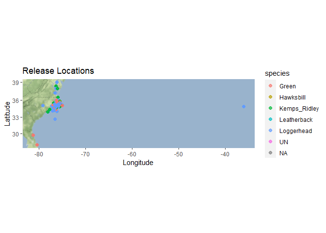
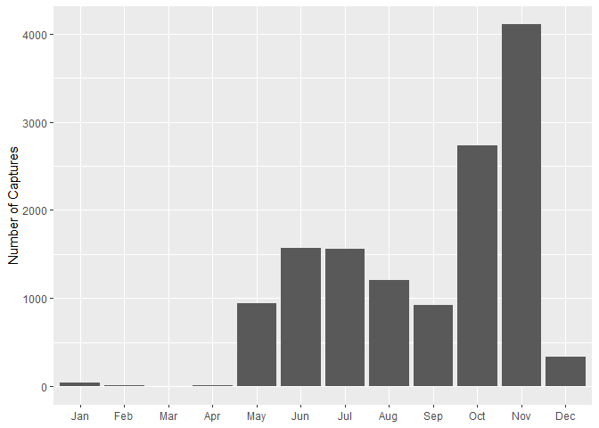
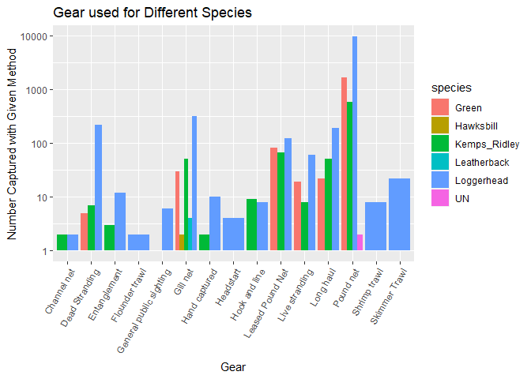

```r
library(here)
```

```
## here() starts at /Users/isaiahbluestein/Desktop/BIS15L-Group3-Final/BIS15L-Group3-Final
```

```r
library(tidyverse)
```

```
## ── Attaching packages ─────────────────────────────────────── tidyverse 1.3.0 ──
```

```
## ✓ ggplot2 3.3.3     ✓ purrr   0.3.4
## ✓ tibble  3.1.0     ✓ dplyr   1.0.4
## ✓ tidyr   1.1.2     ✓ stringr 1.4.0
## ✓ readr   1.4.0     ✓ forcats 0.5.1
```

```
## ── Conflicts ────────────────────────────────────────── tidyverse_conflicts() ──
## x dplyr::filter() masks stats::filter()
## x dplyr::lag()    masks stats::lag()
```

```r
library(naniar)
library(janitor)
```

```
## 
## Attaching package: 'janitor'
```

```
## The following objects are masked from 'package:stats':
## 
##     chisq.test, fisher.test
```

```r
library(shiny)
library(paletteer)
library(ggmap)
```

```
## Google's Terms of Service: https://cloud.google.com/maps-platform/terms/.
```

```
## Please cite ggmap if you use it! See citation("ggmap") for details.
```

```r
library(rgeos)
```

```
## Loading required package: sp
```

```
## rgeos version: 0.5-5, (SVN revision 640)
##  GEOS runtime version: 3.8.1-CAPI-1.13.3 
##  Linking to sp version: 1.4-2 
##  Polygon checking: TRUE
```

```r
library(rgdal)
```

```
## rgdal: version: 1.5-23, (SVN revision 1121)
## Geospatial Data Abstraction Library extensions to R successfully loaded
## Loaded GDAL runtime: GDAL 3.1.4, released 2020/10/20
## Path to GDAL shared files: /Library/Frameworks/R.framework/Versions/4.0/Resources/library/rgdal/gdal
## GDAL binary built with GEOS: TRUE 
## Loaded PROJ runtime: Rel. 6.3.1, February 10th, 2020, [PJ_VERSION: 631]
## Path to PROJ shared files: /Library/Frameworks/R.framework/Versions/4.0/Resources/library/rgdal/proj
## Linking to sp version:1.4-5
## To mute warnings of possible GDAL/OSR exportToProj4() degradation,
## use options("rgdal_show_exportToProj4_warnings"="none") before loading rgdal.
```

```r
library(devtools)
```

```
## Loading required package: usethis
```


```r
turtles<-read.csv(here("Final Project","Turtle_data.csv"))
```


```r
turtles_tidy<-turtles%>%
  na_if("")%>%
  na_if("0")%>%
  na_if("0.0")%>%
  mutate(dead_alive_new=if_else(Dead_Alive=="alive","Alive",Dead_Alive))
```


```r
library(lubridate)
```

```
## 
## Attaching package: 'lubridate'
```

```
## The following objects are masked from 'package:rgeos':
## 
##     intersect, setdiff, union
```

```
## The following objects are masked from 'package:base':
## 
##     date, intersect, setdiff, union
```


```r
turtles3<-turtles_tidy%>%
  mutate(DateCapture_new=dmy(DateCapture))%>%
  filter(!is.na(DateCapture_new))%>%
  mutate(Capture_month=month(DateCapture_new))%>%
  mutate(Capture_day=day(DateCapture_new))%>%
  mutate(capture_week_day=wday(DateCapture_new))
turtles3<-clean_names(turtles3)
head(turtles3)
```

```
##   year turtle_id research_type date_capture      species master_tag dead_alive
## 1 1995         1 Misc. Tagging    16-May-95        Green     QQS241      Alive
## 2 1995         1 Misc. Tagging    16-May-95        Green     QQS241      Alive
## 3 1995         2 Misc. Tagging    24-Apr-95   Loggerhead     QQV299      Alive
## 4 1995         2 Misc. Tagging    24-Apr-95   Loggerhead     QQV299      Alive
## 5 1995         3 Misc. Tagging    12-Jun-95 Kemps_Ridley     QQV296      Alive
## 6 1995         3 Misc. Tagging    12-Jun-95 Kemps_Ridley     QQV296      Alive
##   record_type inconel_tag  body_area    pit_tag body_area_pit date_release
## 1     Release      QQS241  Left Rear       None          <NA>    17-May-95
## 2     Release      QQS242 Right Rear       None          <NA>    17-May-95
## 3     Release      QQV299  Left Rear NOT TAGGED          <NA>    26-May-95
## 4     Release      QQV300 Right Rear NOT TAGGED          <NA>    26-May-95
## 5     Release      QQV296  Left Rear       None          <NA>    12-Jun-95
## 6     Release      QQV297 Right Rear       None          <NA>    12-Jun-95
##        gear scl_notch scl_tip  scw ccl_notch ccl_tip  ccw circumference girth
## 1  Gill net      29.8    30.2 25.3      31.0    31.5 28.0            NA    NA
## 2  Gill net      29.8    30.2 25.3      31.0    31.5 28.0            NA    NA
## 3  Gill net      45.9    46.4 39.8      49.4    50.2 47.7            NA    NA
## 4  Gill net      45.9    46.4 39.8      49.4    50.2 47.7            NA    NA
## 5 Pound net      44.5    45.1 42.0      46.1    46.5 46.0            NA    NA
## 6 Pound net      44.5    45.1 42.0      46.1    46.5 46.0            NA    NA
##   depth_mid tail weight cap_region rel_region cap_latitude cap_longitude
## 1        NA   NA    3.8    Inshore    Inshore        34.78      -76.7233
## 2        NA   NA    3.8    Inshore    Inshore        34.78      -76.7233
## 3        NA   NA   15.3    Inshore   Offshore        34.77      -76.7500
## 4        NA   NA   15.3    Inshore   Offshore        34.77      -76.7500
## 5        NA   NA     NA    Inshore    Inshore        34.96      -76.2633
## 6        NA   NA     NA    Inshore    Inshore        34.96      -76.2633
##   rel_latitude rel_longitude hep_tube_before hep_tube_after test_level_before
## 1        34.73     -76.69000            <NA>           <NA>                NA
## 2        34.73     -76.69000            <NA>           <NA>                NA
## 3        34.66     -76.66167            <NA>           <NA>                NA
## 4        34.66     -76.66167            <NA>           <NA>                NA
## 5        35.00     -76.30500            <NA>           <NA>                NA
## 6        35.00     -76.30500            <NA>           <NA>                NA
##   test_level_after lysis_tube_id skin_biopsy_id haplotype oxtetracyclene
## 1               NA             1             NA      <NA>          FALSE
## 2               NA             1             NA      <NA>          FALSE
## 3               NA             2             NA      <NA>          FALSE
## 4               NA             2             NA      <NA>          FALSE
## 5               NA             3             NA      <NA>          FALSE
## 6               NA             3             NA      <NA>          FALSE
##   health_blood satellite_tag holding_facility          sex_laparoscopy
## 1        FALSE         FALSE             <NA> Sample was not collected
## 2        FALSE         FALSE             <NA> Sample was not collected
## 3        FALSE         FALSE             <NA> Sample was not collected
## 4        FALSE         FALSE             <NA> Sample was not collected
## 5        FALSE         FALSE             <NA> Sample was not collected
## 6        FALSE         FALSE             <NA> Sample was not collected
##               sex_necropsy sex_testosterone_level_1 sex_testosterone_level_2
## 1                     <NA>                     <NA>                     <NA>
## 2                     <NA>                     <NA>                     <NA>
## 3                     <NA>                     <NA>                     <NA>
## 4                     <NA>                     <NA>                     <NA>
## 5 Sample was not collected Sample was not collected Sample was not collected
## 6 Sample was not collected Sample was not collected Sample was not collected
##   state hematology oc_ob    fh metals sia_skin sia_bone sia_blood sia_barnacles
## 1    NC      FALSE FALSE FALSE  FALSE    FALSE    FALSE     FALSE         FALSE
## 2    NC      FALSE FALSE FALSE  FALSE    FALSE    FALSE     FALSE         FALSE
## 3    NC      FALSE FALSE FALSE  FALSE    FALSE    FALSE     FALSE         FALSE
## 4    NC      FALSE FALSE FALSE  FALSE    FALSE    FALSE     FALSE         FALSE
## 5    NC      FALSE FALSE FALSE  FALSE    FALSE    FALSE     FALSE         FALSE
## 6    NC      FALSE FALSE FALSE  FALSE    FALSE    FALSE     FALSE         FALSE
##   sia_scutes sia_analyzed photos scute cloacal lesion   fat fecal pathogens pcv
## 1      FALSE        FALSE  FALSE FALSE   FALSE  FALSE FALSE FALSE     FALSE  NA
## 2      FALSE        FALSE  FALSE FALSE   FALSE  FALSE FALSE FALSE     FALSE  NA
## 3      FALSE        FALSE  FALSE FALSE   FALSE  FALSE FALSE FALSE     FALSE  NA
## 4      FALSE        FALSE  FALSE FALSE   FALSE  FALSE FALSE FALSE     FALSE  NA
## 5      FALSE        FALSE  FALSE FALSE   FALSE  FALSE FALSE FALSE     FALSE  NA
## 6      FALSE        FALSE  FALSE FALSE   FALSE  FALSE FALSE FALSE     FALSE  NA
##   ts entangled imaging organ_biopsy living_tag radio_tag acoustic_tag
## 1 NA     FALSE   FALSE        FALSE      FALSE     FALSE        FALSE
## 2 NA     FALSE   FALSE        FALSE      FALSE     FALSE        FALSE
## 3 NA     FALSE   FALSE        FALSE      FALSE     FALSE        FALSE
## 4 NA     FALSE   FALSE        FALSE      FALSE     FALSE        FALSE
## 5 NA     FALSE   FALSE        FALSE      FALSE     FALSE        FALSE
## 6 NA     FALSE   FALSE        FALSE      FALSE     FALSE        FALSE
##   dead_alive_new date_capture_new capture_month capture_day capture_week_day
## 1          Alive       1995-05-16             5          16                3
## 2          Alive       1995-05-16             5          16                3
## 3          Alive       1995-04-24             4          24                2
## 4          Alive       1995-04-24             4          24                2
## 5          Alive       1995-06-12             6          12                2
## 6          Alive       1995-06-12             6          12                2
```

```r
view(turtles3)
```

#mapping for release and capture sites


```r
turtles3%>%
  select(cap_latitude,cap_longitude)%>%
  summary()
```

```
##   cap_latitude   cap_longitude   
##  Min.   :33.49   Min.   :-79.08  
##  1st Qu.:34.84   1st Qu.:-76.38  
##  Median :34.93   Median :-76.27  
##  Mean   :34.96   Mean   :-76.24  
##  3rd Qu.:35.05   3rd Qu.:-76.13  
##  Max.   :38.41   Max.   :-75.47
```


```r
cap_lat <- c(33.49, 38.41)
cap_long <- c(-79.08, -75.47)
bbox <- make_bbox(cap_long, cap_lat, f = 0.1)
```


```r
cap_map_base <- get_map(bbox, maptype = "terrain-background", source = "stamen")
```

```
## Map tiles by Stamen Design, under CC BY 3.0. Data by OpenStreetMap, under ODbL.
```

```r
ggmap(cap_map_base)
```

<!-- -->


```r
ggmap(cap_map_base) + 
  geom_point(data = turtles3, aes(cap_longitude,cap_latitude,color=species,shape=dead_alive_new), size = 2, alpha = 0.7) +
           labs(x = "Longitude", y = "Latitude", title = "Capture Locations")
```

```
## Warning: Removed 1 rows containing missing values (geom_point).
```

<!-- -->

```r
turtles3%>%
  select(rel_latitude,rel_longitude)%>%
  summary()
```

```
##   rel_latitude   rel_longitude   
##  Min.   :27.82   Min.   :-81.24  
##  1st Qu.:34.83   1st Qu.:-76.38  
##  Median :34.89   Median :-76.33  
##  Mean   :34.92   Mean   :-76.26  
##  3rd Qu.:35.04   3rd Qu.:-76.12  
##  Max.   :39.00   Max.   :-36.03  
##  NA's   :351     NA's   :353
```


```r
rel_lat <- c(27.82, 39)
rel_long <- c(-81.24, -36.03)
bbox2 <- make_bbox(rel_long, rel_lat, f = 0.05)
```


```r
rel_map_base <- get_map(bbox2, maptype = "terrain-background", source = "stamen")
```

```
## Map tiles by Stamen Design, under CC BY 3.0. Data by OpenStreetMap, under ODbL.
```

```r
ggmap(rel_map_base)
```

<!-- -->

```r
ggmap(rel_map_base) + 
  geom_point(data = turtles3, aes(rel_longitude,rel_latitude,color=species), size = 2, alpha = 0.7) +
           labs(x = "Longitude", y = "Latitude", title = "Release Locations")
```

```
## Warning: Removed 353 rows containing missing values (geom_point).
```

<!-- -->
#we can then make additional maps with color or shape of the dots for different variables. We also should pick a unifying color scheme/text/chart and map theme for all of our images (Ideally a color that stands out against the terrain background if we want to stick with terrain for our maps)

#The following are some ideas for graphs that I thought would be good to include, but we can each come up and explore some of our own to compile into the final product


```r
turtles3%>%
  group_by(year)%>%
  summarise(n())
```

```
## # A tibble: 28 x 2
##     year `n()`
##  * <int> <int>
##  1  1988   154
##  2  1989    82
##  3  1990    18
##  4  1991    17
##  5  1992    50
##  6  1993    22
##  7  1994   193
##  8  1995   464
##  9  1996   500
## 10  1997   463
## # … with 18 more rows
```

```r
turtles3%>%
  group_by(year)%>%
  ggplot(aes(x=year,fill=dead_alive_new))+
  geom_bar(position = "dodge")
```

<!-- -->


```r
turtles3%>%
  group_by(capture_month)%>%
  summarise(n())
```

```
## # A tibble: 12 x 2
##    capture_month `n()`
##  *         <dbl> <int>
##  1             1    41
##  2             2     9
##  3             3     8
##  4             4    15
##  5             5   945
##  6             6  1567
##  7             7  1556
##  8             8  1201
##  9             9   918
## 10            10  2735
## 11            11  4106
## 12            12   334
```

```r
turtles3%>%
  ggplot(aes(month(x=date_capture_new,label=TRUE)))+
  geom_bar(position = "dodge")+
  labs(x = NULL,
         y = "Number of Captures")
```

<!-- -->


```r
turtles3%>%
  group_by(capture_day)%>%
  summarise(n())
```

```
## # A tibble: 31 x 2
##    capture_day `n()`
##  *       <int> <int>
##  1           1   432
##  2           2   415
##  3           3   222
##  4           4   383
##  5           5   445
##  6           6   469
##  7           7   487
##  8           8   374
##  9           9   458
## 10          10   586
## # … with 21 more rows
```


```r
turtles3%>%
  ggplot(aes(day(x=date_capture_new)))+
  geom_density(fill="green")+
  labs(x = NULL,
         y = "Number of Captures")
```

<!-- -->


```r
turtles3%>%
  group_by(capture_week_day)%>%
  summarise(n())
```

```
## # A tibble: 7 x 2
##   capture_week_day `n()`
## *            <dbl> <int>
## 1                1   352
## 2                2  3530
## 3                3  2315
## 4                4  1574
## 5                5  1590
## 6                6  3613
## 7                7   461
```

```r
turtles3%>%
  ggplot(aes(wday(x=date_capture_new,label=TRUE)))+
  geom_bar()+
  labs(x = NULL,
         y = "Number of Captures")
```

<!-- -->
#Monday and Friday are popular trapping days apparently


```r
turtles3%>%
  group_by(year)%>%
  mutate(mean_body_length=mean(scl_tip,na.rm=T))%>%
  ggplot(aes(x=year,y=mean_body_length,group=1,color=species))+
  geom_line()+
  geom_point()+
  facet_wrap(~species)
```

```
## geom_path: Each group consists of only one observation. Do you need to adjust
## the group aesthetic?
```

<!-- -->

```r
turtles3%>%
  ggplot(aes(x=species,y=ccl_tip,color=species))+
  geom_boxplot()
```

```
## Warning: Removed 3383 rows containing non-finite values (stat_boxplot).
```

<!-- -->
#we of course can fix the axis and replicate this kind of graph for other measurements (SCL_noth/SCl_tip, CCl_notch, etc)


```r
turtles3%>%
  filter(gear!=""&species!="")%>%
  ggplot(aes(x=gear,fill=species))+
  geom_bar(position = "dodge")+
  labs(title = "Gear used for Different Species",x="Gear",y="Number Captured with Given Method")+
  theme(axis.text.x = element_text(angle = 60,hjust = 1))+
  scale_y_log10()
```

<!-- -->

```r
names(turtles3)
```

```
##  [1] "year"                     "turtle_id"               
##  [3] "research_type"            "date_capture"            
##  [5] "species"                  "master_tag"              
##  [7] "dead_alive"               "record_type"             
##  [9] "inconel_tag"              "body_area"               
## [11] "pit_tag"                  "body_area_pit"           
## [13] "date_release"             "gear"                    
## [15] "scl_notch"                "scl_tip"                 
## [17] "scw"                      "ccl_notch"               
## [19] "ccl_tip"                  "ccw"                     
## [21] "circumference"            "girth"                   
## [23] "depth_mid"                "tail"                    
## [25] "weight"                   "cap_region"              
## [27] "rel_region"               "cap_latitude"            
## [29] "cap_longitude"            "rel_latitude"            
## [31] "rel_longitude"            "hep_tube_before"         
## [33] "hep_tube_after"           "test_level_before"       
## [35] "test_level_after"         "lysis_tube_id"           
## [37] "skin_biopsy_id"           "haplotype"               
## [39] "oxtetracyclene"           "health_blood"            
## [41] "satellite_tag"            "holding_facility"        
## [43] "sex_laparoscopy"          "sex_necropsy"            
## [45] "sex_testosterone_level_1" "sex_testosterone_level_2"
## [47] "state"                    "hematology"              
## [49] "oc_ob"                    "fh"                      
## [51] "metals"                   "sia_skin"                
## [53] "sia_bone"                 "sia_blood"               
## [55] "sia_barnacles"            "sia_scutes"              
## [57] "sia_analyzed"             "photos"                  
## [59] "scute"                    "cloacal"                 
## [61] "lesion"                   "fat"                     
## [63] "fecal"                    "pathogens"               
## [65] "pcv"                      "ts"                      
## [67] "entangled"                "imaging"                 
## [69] "organ_biopsy"             "living_tag"              
## [71] "radio_tag"                "acoustic_tag"            
## [73] "dead_alive_new"           "date_capture_new"        
## [75] "capture_month"            "capture_day"             
## [77] "capture_week_day"
```
#This App is for some categorical variables across the years for different spcecies

```r
library(shinydashboard)
```

```
## 
## Attaching package: 'shinydashboard'
```

```
## The following object is masked from 'package:graphics':
## 
##     box
```


```r
turtles3$year<-as.character(turtles3$year)
ui <- dashboardPage(skin="green",
  dashboardHeader(title = "Turtle Captures"),
  dashboardSidebar(disable = F),
  dashboardBody(selectInput("species", "Select Species:", 
                  choices=unique(turtles3$species)),
  fluidRow(
  box(title = "Plot Options", width = 4,
  selectInput("x", "Catch Details", choices = c("research_type","dead_alive_new", "body_area_pit","body_area","record_type","cap_region","rel_region"), 
              selected = "record_type"),
      hr(),
      helpText("Source: (https://www.fisheries.noaa.gov/inport/item/35875). Capture efforts were conducted to evaluate the growth rates, sex ratios, size distribution, species composition, genetic composition, relative survival rates and foraging ecology of sea turtle populations in NC.")
  ), 
  box(title = "Turtle Information", width = 8,
  plotOutput("plot", width = "800px", height = "500px")
  ) 
  ) 
  ) 
  )
server <- function(input, output, session) { 
  
  output$plot <- renderPlot({
  turtles3 %>%
      filter(species == input$species) %>%
  ggplot(aes_string(x ="year",fill = input$x)) +
  geom_bar(position = "dodge")+
       scale_fill_brewer(palette = "Set1")+
  theme_light(base_size = 18)+
     theme(axis.text.x = element_text(angle = 60, hjust = 1))+
      labs(title = "Turtle Catch Characterisitics",x=NULL,y="Number of Turtles")
  })
  
  session$onSessionEnded(stopApp)
  }

shinyApp(ui, server)
```

`<div style="width: 100% ; height: 400px ; text-align: center; box-sizing: border-box; -moz-box-sizing: border-box; -webkit-box-sizing: border-box;" class="muted well">Shiny applications not supported in static R Markdown documents</div>`{=html}


```r
turtles3%>%
  tabyl(haplotype)
```

```
##  haplotype     n      percent valid_percent
##          ?     8 5.954596e-04  0.0040485830
##          A   355 2.642352e-02  0.1796558704
##         A1     4 2.977298e-04  0.0020242915
##         A2     2 1.488649e-04  0.0010121457
##          B   205 1.525865e-02  0.1037449393
##          C    20 1.488649e-03  0.0101214575
##       C,A1     1 7.443245e-05  0.0005060729
##      CcA02     2 1.488649e-04  0.0010121457
##       Cca1     4 2.977298e-04  0.0020242915
##       CcA1   630 4.689245e-02  0.3188259109
##      CcA10    12 8.931894e-04  0.0060728745
##      CcA13     8 5.954596e-04  0.0040485830
##      CcA14    28 2.084109e-03  0.0141700405
##      CcA19     6 4.465947e-04  0.0030364372
##       CcA2   388 2.887979e-02  0.1963562753
##      CcA20     4 2.977298e-04  0.0020242915
##       CcA3    52 3.870488e-03  0.0263157895
##       CcA5     4 2.977298e-04  0.0020242915
##       CcA7     6 4.465947e-04  0.0030364372
##       CcA9     1 7.443245e-05  0.0005060729
##       CmA1    39 2.902866e-03  0.0197368421
##      CmA13     2 1.488649e-04  0.0010121457
##      CmA16     1 7.443245e-05  0.0005060729
##      CmA18     1 7.443245e-05  0.0005060729
##       CmA2     1 7.443245e-05  0.0005060729
##      CmA22     4 2.977298e-04  0.0020242915
##      CmA26     3 2.232974e-04  0.0015182186
##      CmA27     5 3.721623e-04  0.0025303644
##      CmA28     2 1.488649e-04  0.0010121457
##       CmA3    45 3.349460e-03  0.0227732794
##      CmA48     4 2.977298e-04  0.0020242915
##       CmA5     6 4.465947e-04  0.0030364372
##      CmA53     1 7.443245e-05  0.0005060729
##       CmA7     1 7.443245e-05  0.0005060729
##       CmA8    11 8.187570e-04  0.0055668016
##        CMI    20 1.488649e-03  0.0101214575
##      CMIII    18 1.339784e-03  0.0091093117
##        CMV     6 4.465947e-04  0.0030364372
##     CMVIII     4 2.977298e-04  0.0020242915
##    CMXVIII     6 4.465947e-04  0.0030364372
##          D     2 1.488649e-04  0.0010121457
##          E     6 4.465947e-04  0.0030364372
##          G    10 7.443245e-04  0.0050607287
##          H     2 1.488649e-04  0.0010121457
##          I     2 1.488649e-04  0.0010121457
##          J     8 5.954596e-04  0.0040485830
##          M     2 1.488649e-04  0.0010121457
##          N    14 1.042054e-03  0.0070850202
##       REDO    10 7.443245e-04  0.0050607287
##       <NA> 11459 8.529215e-01            NA
```
#This next app shows which tests were perfomed across the years.


```r
turtles3$year<-as.character(turtles3$year)
ui <- dashboardPage(skin="green",
  dashboardHeader(title = "Turtle Capture Tests"),
  dashboardSidebar(disable = F),
  dashboardBody(selectInput("species", "Select Species:", 
                  choices=unique(turtles3$species)),
  fluidRow(
  box(title = "Plot Options", width = 4,
  selectInput("x", "Type of Test", choices = c("oxtetracyclene","health_blood","satellite_tag","holding_facility","sex_laparoscopy",     "sex_necropsy","sex_testosterone_level_1","sex_testosterone_level_2","hematology","oc_ob","fh","metals","sia_skin","sia_bone",     "sia_blood","sia_barnacles","sia_scutes","sia_analyzed","photos","scute","cloacal","lesion","fat","fecal","pathogens",     "entangled","imaging","organ_biopsy"), 
              selected = "entangled"),
      hr(),
      helpText("Source: (https://www.fisheries.noaa.gov/inport/item/35875). Capture efforts were conducted to evaluate the growth rates, sex ratios, size distribution, species composition, genetic composition, relative survival rates and foraging ecology of sea turtle populations in NC.")
  ), 
  box(title = "Test Performed T/F", width = 8,
  plotOutput("plot", width = "800px", height = "500px")
  ) 
  ) 
  ) 
  )
server <- function(input, output, session) { 
  
  output$plot <- renderPlot({
  turtles3 %>%
      filter(species == input$species) %>%
  ggplot(aes_string(x ="year",fill = input$x)) +
  geom_bar(position = "dodge")+
       scale_fill_brewer(palette = "Set1")+
  theme_light(base_size = 18)+
     theme(axis.text.x = element_text(angle = 60, hjust = 1))+
      labs(title = "Tests Performed On Turtles",x=NULL,y="Number of Turtles Tested for Selected Test")
  })
  
  session$onSessionEnded(stopApp)
  }

shinyApp(ui, server)
```

`<div style="width: 100% ; height: 400px ; text-align: center; box-sizing: border-box; -moz-box-sizing: border-box; -webkit-box-sizing: border-box;" class="muted well">Shiny applications not supported in static R Markdown documents</div>`{=html}

Quantitative Data Apps (rought first idea, will adjust aes on Thursday)

```r
ui <- dashboardPage(
  dashboardHeader(title = "Turtle Measurements"),
  dashboardSidebar(disable = T),
  dashboardBody(
  fluidRow(
  box(
  selectInput("x", "Select X Variable", choices = c("scl_notch ", "scl_tip", "scw", "ccl_notch", "ccl_tip", "ccw", "circumference", "tail", "girth", "depth_mid", "weight"), selected = "scl_notch"),
  selectInput("y", "Select Y Variable", choices = c("scl_notch ", "scl_tip", "scw", "ccl_notch", "ccl_tip", "ccw", "circumference", "tail", "girth", "depth_mid", "weight"), selected = "scl_notch"),
  ), # close the first box
  box(
  plotOutput("plot", width = "500px", height = "500px")
  ) 
  ) 
  ) 
) 

server <- function(input, output, session) { 
  output$plot <- renderPlot({
  ggplot(turtles3, aes_string(x = input$x, y = input$y)) + geom_point(alpha=0.8) + theme_light(base_size = 18)
  })
  session$onSessionEnded(stopApp)
  }

shinyApp(ui, server)
```

`<div style="width: 100% ; height: 400px ; text-align: center; box-sizing: border-box; -moz-box-sizing: border-box; -webkit-box-sizing: border-box;" class="muted well">Shiny applications not supported in static R Markdown documents</div>`{=html}

```r
ui <- dashboardPage(
  dashboardHeader(title = "Turtle Measurements"),
  dashboardSidebar(disable = T),
  dashboardBody(
  fluidRow(
  box(
  selectInput("x", "Select X Variable", choices = c("cap_latitude", "cap_longitude"), selected = "scl_notch"),
  selectInput("y", "Select Y Variable", choices = c("scl_notch ", "scl_tip", "scw", "ccl_notch", "ccl_tip", "ccw", "circumference", "tail", "girth", "depth_mid", "weight"), selected = "scl_notch"),
  ), # close the first box
  box(
  plotOutput("plot", width = "500px", height = "500px")
  ) 
  ) 
  ) 
) 

server <- function(input, output, session) { 
  output$plot <- renderPlot({
  ggplot(turtles3, aes_string(x = input$x, y = input$y)) + geom_point(alpha=0.8) + theme_light(base_size = 18)
  })
  session$onSessionEnded(stopApp)
  }

shinyApp(ui, server)
```

`<div style="width: 100% ; height: 400px ; text-align: center; box-sizing: border-box; -moz-box-sizing: border-box; -webkit-box-sizing: border-box;" class="muted well">Shiny applications not supported in static R Markdown documents</div>`{=html}
#My second app was an interesting idea, but it doesn't come out that pretty. Might just make some new maps where I scale point size by turtle weight, size, or depth. 

Additional Graph Ideas: 

```r
turtles3 %>% 
    mutate(mass_category = case_when(weight <= 30 ~ "small", weight >= 30 ~ "large")) %>% 
  group_by(year) %>% 
  ggplot(aes(x = year, fill = mass_category))+
  geom_bar()+
  labs(title = "Turtle Capture by Weight Class",
       x = "Year",
       y= "n")+
    theme_linedraw()+
  theme(axis.text.x = element_text(angle = 60, hjust = 1), plot.title = element_text(size = rel(1.5), hjust = 0.5))
```

<!-- -->


